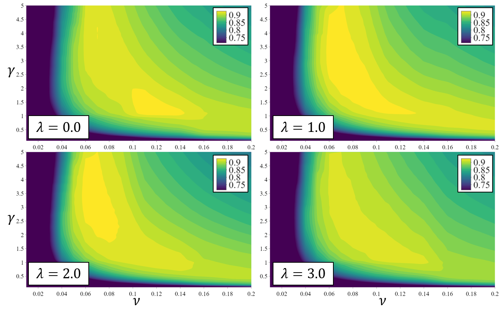

# Explainable Gait Recognition with Prototyping Encoder Decoder
This repository is the official implementation of Explainable Gait Recognition with Prototyping Encoder–Decoder paper, which proposes a method to successfuly address the open set gait recognition problem.

The code here implements an encoder-decoder network architecture that learns mapping from the input (the gait information consistent of unit steps) to a latent space. The network utilizes two types of loss functions. The first one is based on the triplet loss function and it enforces that the distances in a latent space of homogeneous input pairs are smaller than those of heterogeneous input pairs. The second loss function minimizes the difference between reconstructed inputs and their corresponding prototypes. 

Also here is implemented the module that allows the analysis of which part of the input is relevant to the recognition performance by using explainable tools such as sensitivity analysis (SA) and layer-wise relevance propagation (LRP) which are available at the iNNvestigate toolbox (pypi.org/project/innvestigate/)

# Requirements
The main packages used for this project are Tensorflow-gpu 1.14, Keras 2.2.4, innvestigate 1.08, and scikit-learn 0.23.2.
It is recommended to create a new environment and install the packages listed in requirements.txt:
```
pip install -r requirements.txt
```

# Datasets
As shown in the figure, the data was collected from 30 subjects and it was split into three sets: 


- <b>Training set</b>: used to train the encoder-decoder network. It consists of all the unit steps of 16 individuals selected randomly.
- <b>Known-test set</b>: it contains the unit steps of 7 individuals selected randomly from the 14 remaining people after selecting the training set. This dataset is divided in two subsets. The first subset consists of 10 unit steps for each individual and it is used for training the OSVM classifier. The second subset is the remaining steps of the same 7 individuals and it is used to test the classifier as known data in the open set gait recognition problem.
- <b>Unknown test set</b>: it contains all the unit steps of the remaining 7 subjects which were not used in any training process, therefore they are unknown subjects. It is used for testing the classifier as unknown data in the open set gait recognition problem.

# Modules
To train the models in the paper, run this command:
```
cd code
python training.py
```
We repeat our experiment 10 times...

# Evaluation
We divide our test set into ...


# Pre-trained Model
You can download pretrained model here: ...


# Results
Performance as function of lambda:



# Contributors
Nelson Minaya nelson.minaya@student.csulb.edu <br/>
Sella Bae sella.bae@student.csulb.edu <br/>

